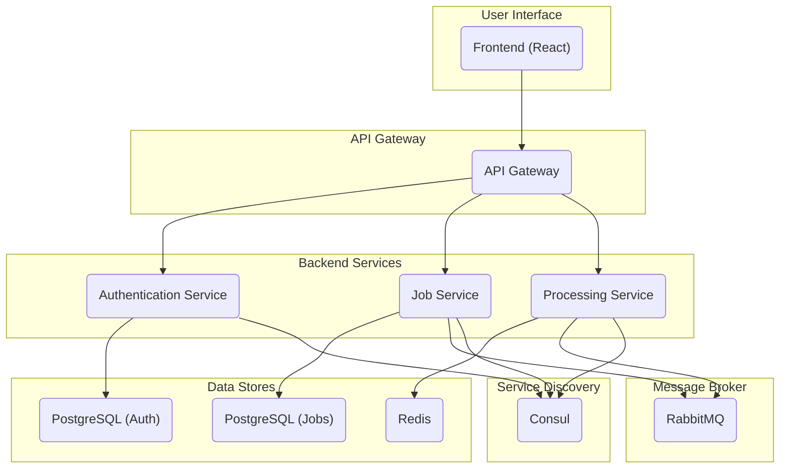

# Project Title

This project is a microservices-based application for processing and managing jobs. It consists of a frontend application, an API gateway, and several backend services for authentication, job handling, and processing.

## Architecture

The application is composed of the following services:

*   **Frontend:** A React-based single-page application that provides the user interface.
*   **API Gateway:** A single entry point for all client requests. It routes requests to the appropriate backend service.
*   **Authentication Service:** Handles user authentication and authorization.
*   **Job Service:** Manages jobs, including creating, updating, and deleting them.
*   **Processing Service:** Processes jobs that are submitted by users.

### Architecture Diagram



## Services

This section provides a brief overview of each service in the application.

### API Gateway

The API gateway is the single entry point for all client requests. It is responsible for routing requests to the appropriate backend service, as well as for handling authentication and rate limiting. It is located in the `api_gateway` directory.

### Authentication Service

The authentication service is responsible for handling user authentication and authorization. It manages user accounts and provides a secure way for users to log in to the application. It is located in the `auth_service` directory.

### Job Service

The job service manages jobs, including creating, updating, and deleting them. It is located in the `job_service` directory.

### Processing Service

The processing service is responsible for processing jobs that are submitted by users. It is a background service that consumes jobs from the message broker and performs the required processing. It is located in the `processing_service` directory.

### Frontend

The frontend is a React-based single-page application that provides the user interface for the application. It is located in the `frontend` directory.

### Data Stores

The application uses several data stores to persist data:

*   **PostgreSQL (Authentication):** This database stores user account information for the authentication service.
*   **PostgreSQL (Jobs):** This database stores job information for the job service.
*   **Redis:** This is used as a cache and for other purposes by the processing service.

### Message Broker

The application uses RabbitMQ as a message broker to enable asynchronous communication between services. The job service produces messages that are consumed by the processing service.

## Getting Started

To get started with this project, you will need to have Docker and Docker Compose installed on your machine.

### Prerequisites

*   [Docker](https://docs.docker.com/get-docker/)
*   [Docker Compose](https://docs.docker.com/compose/install/)

### Installation

1.  Clone the repository:

    ```bash
    git clone https://github.com/your-username/your-repository.git
    ```

2.  Create a `.env` file by copying the `.env.example` file:

    ```bash
    cp .env.example .env
    ```

3.  Update the `.env` file with your own configuration values.

4.  Start the application:

    ```bash
    docker-compose up
    ```

    This will start all of the services in the application. You can then access the frontend application by navigating to `http://localhost:3000` in your web browser.

## Contributing

Contributions are welcome! If you would like to contribute to this project, please follow these steps:

1.  Fork the repository.
2.  Create a new branch for your changes.
3.  Make your changes and commit them to your branch.
4.  Push your changes to your fork.
5.  Submit a pull request to the main repository.

### Development Environment

To set up the development environment, you will need to have Docker and Docker Compose installed on your machine. Once you have them installed, you can run the following command to start the application:

```bash
docker-compose up --build
```

This will build the Docker images for all of the services and start them.

### Testing

To run the tests for a specific service, you can use the following command:

```bash
docker-compose run <service_name> pytest
```

Replace `<service_name>` with the name of the service that you want to test.
