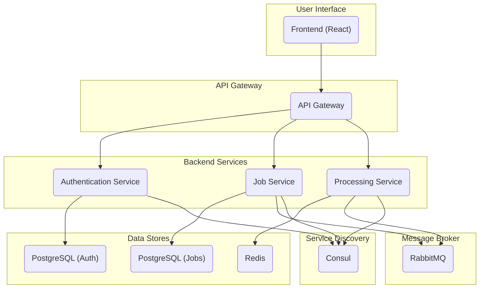

# Image Processing Microservice Application

This project is a comprehensive, microservices-based application designed for processing and managing image-related jobs. It features a modern frontend built with React, an API gateway to route requests, and a suite of backend services for user authentication, job management, and image processing.

## Table of Contents

*   [Architecture](#architecture)
*   [Technologies Used](#technologies-used)
*   [Services](#services)
    *   [API Gateway](#api-gateway)
    *   [Authentication Service](#authentication-service)
    *   [Job Service](#job-service)
    *   [Processing Service](#processing-service)
    *   [Frontend](#frontend)
*   [Getting Started](#getting-started)
    *   [Prerequisites](#prerequisites)
    *   [Installation](#installation)
*   [Contributing](#contributing)
    *   [Development Environment](#development-environment)
    *   [Testing](#testing)

## Technologies Used

*   **Frontend:** React, Vite, Tailwind CSS
*   **Backend:** Node.js (API Gateway), Python (Auth, Job, Processing Services)
*   **Databases:** PostgreSQL, Redis
*   **Messaging:** RabbitMQ
*   **Containerization:** Docker, Docker Compose

## Architecture

The application is composed of the following services:

*   **Frontend:** A React-based single-page application that provides the user interface.
*   **API Gateway:** A single entry point for all client requests. It routes requests to the appropriate backend service.
*   **Authentication Service:** Handles user authentication and authorization.
*   **Job Service:** Manages jobs, including creating, updating, and deleting them.
*   **Processing Service:** Processes jobs that are submitted by users.

### Architecture Diagram



## Services

This section provides a more detailed overview of each service in the application.

### API Gateway

*   **Location:** `api_gateway`
*   **Technology:** Node.js, Express
*   **Responsibilities:**
    *   Acts as a single entry point for all client requests.
    *   Routes requests to the appropriate backend service.
    *   Handles authentication and rate limiting.

### Authentication Service

*   **Location:** `auth_service`
*   **Technology:** Python, Flask, PostgreSQL
*   **Responsibilities:**
    *   Manages user accounts and authentication.
    *   Provides JWT-based authentication for securing endpoints.
    *   Handles user registration and login.

### Job Service

*   **Location:** `job_service`
*   **Technology:** Python, FastAPI, PostgreSQL, RabbitMQ
*   **Responsibilities:**
    *   Manages job creation, updates, and status tracking.
    *   Publishes job requests to the message broker for asynchronous processing.
    *   Provides endpoints for retrieving job status and results.

### Processing Service

*   **Location:** `processing_service`
*   **Technology:** Python, Celery, RabbitMQ, Redis
*   **Responsibilities:**
    *   Consumes job requests from the message broker.
    *   Performs the core image processing tasks in the background.
    *   Updates the job status and stores the results.

### Frontend

*   **Location:** `my-react-app`
*   **Technology:** React, Vite, Tailwind CSS
*   **Responsibilities:**
    *   Provides a user-friendly interface for interacting with the application.
    *   Allows users to upload images, manage jobs, and view results.
    *   Communicates with the backend services through the API gateway.

### Data Stores

The application uses the following data stores to persist data:

*   **PostgreSQL:** Used by the `auth_service` to store user account information and by the `job_service` to manage job data.
*   **Redis:** Used by the `processing_service` for caching and other temporary data storage needs.

### Message Broker

*   **RabbitMQ:** Used as a message broker to enable asynchronous communication between the `job_service` and the `processing_service`.

## Getting Started

To get started with this project, you will need to have Docker and Docker Compose installed on your machine.

### Prerequisites

*   [Docker](https://docs.docker.com/get-docker/)
*   [Docker Compose](https://docs.docker.com/compose/install/)

### Installation

1.  **Clone the repository:**

    ```bash
    git clone https://github.com/your-username/your-repository.git
    cd your-repository
    ```

2.  **Create a `.env` file:**

    Copy the `.env.example` file to a new `.env` file:

    ```bash
    cp .env.example .env
    ```

    Update the `.env` file with your own configuration values for the services.

3.  **Start the application:**

    ```bash
    docker-compose up -d
    ```

    This will start all of the services in detached mode. You can then access the frontend application by navigating to `http://localhost:5173` in your web browser.

    **Note:** The frontend application is located in the `my-react-app` directory and is served by Vite, which runs on port 5173 by default.

## Contributing

Contributions are welcome! If you would like to contribute to this project, please follow these steps:

1.  Fork the repository.
2.  Create a new branch for your changes.
3.  Make your changes and commit them to your branch.
4.  Push your changes to your fork.
5.  Submit a pull request to the main repository.

### Development Environment

To set up the development environment, you will need to have Docker and Docker Compose installed on your machine. Once you have them installed, you can run the following command to start the application:

```bash
docker-compose up --build
```

This will build the Docker images for all of the services and start them.

### Testing

To run the tests for a specific service, you can use the `docker-compose run` command. The services with tests are `auth_service`, `job_service`, and `processing_service`.

*   **Run tests for the Authentication Service:**

    ```bash
    docker-compose run auth_service pytest
    ```

*   **Run tests for the Job Service:**

    ```bash
    docker-compose run job_service pytest
    ```

*   **Run tests for the Processing Service:**

    ```bash
    docker-compose run processing_service pytest
    ```

*   **Run all tests at once:**

    You can run all tests for all services by executing the `run_tests.sh` script:

    ```bash
    ./run_tests.sh
    ```
